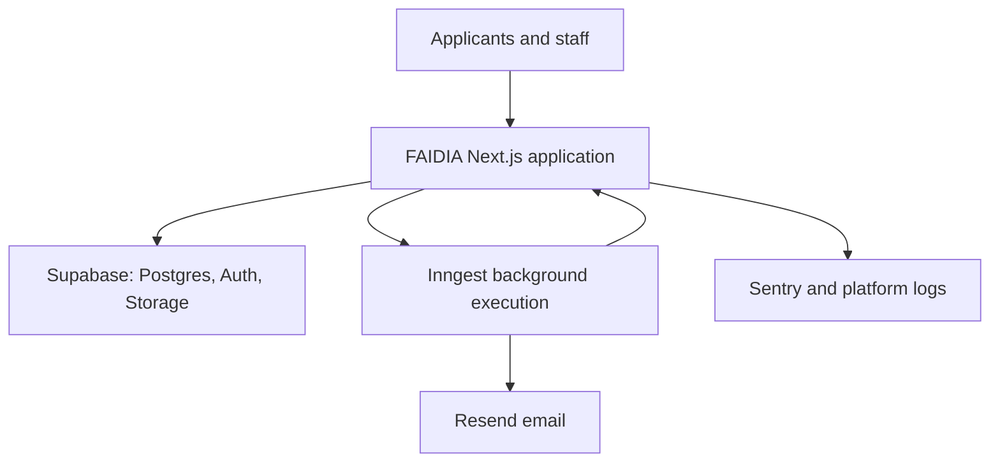
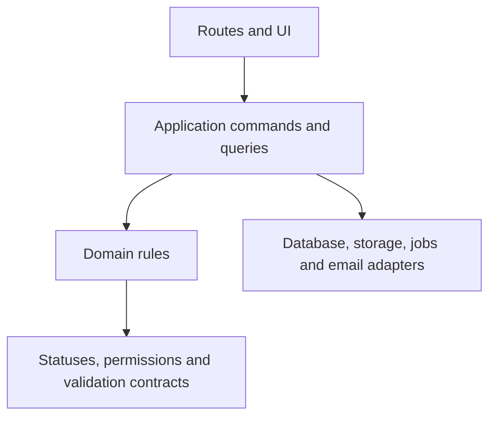

# FAIDIA Stage 1 — Architecture

**Status:** READY_FOR_PRODUCT_OWNER_REVIEW  
**Version:** 0.1  
**Last updated:** 2026-07-14  
**Product:** FAIDIA — Service Operations Platform  
**Authority:** `docs/SOURCE-OF-TRUTH.md`, approved Stage 0 documents, and `docs/01-stage-1/ACCEPTANCE-CRITERIA.md`

## 1. Purpose

This document defines the technical shape of the Stage 1 Transcript Request vertical slice.

In beginner language, architecture answers four questions:

1. What major pieces make up the application?
2. What is each piece allowed to do?
3. How do the pieces communicate?
4. Where must security, transactions, audit history, and retries be enforced?

It does not define individual database columns or every API payload. Those belong to later Stage 1 documents.

## 2. Architectural thesis

Build FAIDIA as a **modular monolith**: one full-stack Next.js application, one repository, and one PostgreSQL database, internally separated into clear modules.

“Monolith” here does not mean unstructured code. It means the public pages, applicant workspace, staff workspace, admin workspace, server operations, background-job endpoint, and shared domain rules ship as one application instead of several separately deployed services.

This is the correct V1 trade-off because FAIDIA needs transactional workflow changes, a shared authorization model, rapid vertical-slice delivery, and consistent audit history more than it needs independently scalable microservices.

## 3. System context

Stage 1 does not introduce a separate frontend server, REST backend, workflow engine, reporting service, file service, or authentication service owned by FAIDIA.

## 4. Application areas

One Next.js application contains these areas:

| Area | Responsibility | Primary audience |
|---|---|---|
| Public | Organization branding and service discovery | Visitors |
| Authentication | Registration and sign-in | Applicants and staff |
| Applicant | Drafts, submissions, tracking, corrections, notifications and outcomes | Applicants |
| Staff | Officer processing, Finance referrals and shared request details | Officers and Supervisors |
| Supervisor | Department visibility and Registrar approval queue | Supervisors and Registrar profile |
| Organization Admin | Limited metadata, service and branding configuration | Organization Admin |
| Technical endpoints | Auth callback, health check and Inngest serving endpoint | Trusted systems |

These are route groups and layouts inside one application, not separate applications.

## 5. Rendering and interaction model

Use React Server Components by default.

Server Components are preferred for:

- authenticated page reads;
- dashboards and queues;
- request details;
- reports and aggregate data;
- configuration views;
- permission-aware navigation assembly.

Use Client Components only when browser interactivity requires them, such as:

- form controls managed by React Hook Form;
- file-selection and upload progress;
- dialogs, drawers, tabs and menus;
- interactive filters and table controls;
- accessible Recharts rendering;
- optimistic feedback that does not decide business truth.

Do not place database access, authorization decisions, secrets, or workflow transitions in Client Components.

## 6. Request and mutation boundaries

### 6.1 Server Components

Use for secure page reads. A Server Component may call an application query after resolving the authenticated actor and active context.

### 6.2 Server Actions

Use for first-party mutations initiated by FAIDIA forms and controls, including draft updates, submission, review actions, correction, handoff actions, decisions, collection, reopening and limited configuration.

A Server Action is a transport adapter. It must not contain the business rule itself. It must:

1. parse and validate input;
2. resolve the actor and active organization context;
3. call one application command;
4. translate the result into safe UI feedback;
5. revalidate or redirect only after a successful command.

### 6.3 Route Handlers

Use only where an HTTP endpoint is actually required:

- Supabase Auth callback;
- Inngest serve endpoint;
- health/readiness check;
- future verified external webhooks or public APIs explicitly approved later.

Do not create a parallel internal REST API merely so the FAIDIA UI can call itself.

## 7. Layer responsibilities

| Layer | May contain | Must not contain |
|---|---|---|
| Routes/UI | rendering, form binding, safe presentation, redirects | direct workflow decisions or raw unrestricted queries |
| Application | use-case orchestration, transaction boundaries, authorization calls, idempotency | React rendering or provider-specific UI behavior |
| Domain | status transitions, invariant checks, permission vocabulary, typed outcomes | framework, database or vendor calls |
| Infrastructure | Drizzle queries, Supabase clients, storage, Inngest, Resend, logging | independent product-policy decisions |

## 8. Command and query model

Commands change state. Queries read state.

Examples of commands:

- create draft;
- submit request;
- start review;
- request correction;
- create or accept handoff;
- record Finance result;
- approve or reject;
- issue outcome;
- complete, reopen or revoke.

Examples of queries:

- list applicant requests;
- load an authorized request workspace;
- list a department queue;
- load the Registrar approval queue;
- calculate supervisor metrics.

Each command has one application entry point. Pages, Server Actions and jobs must not recreate the same transition logic independently.

## 9. Authentication and authorization boundary

Supabase Auth proves who the user is. FAIDIA authorization decides what that authenticated user may do.

Every protected server operation must validate, as applicable:

1. authenticated user;
2. active membership;
3. active organization context;
4. exact permission;
5. department scope;
6. ownership, assignment, claim or handoff scope;
7. current workflow state;
8. target record organization;
9. input schema and stale-state token/version.

PostgreSQL and Storage RLS are defence in depth. They do not replace the application authorization service.

Client-side hiding is presentation only and is never sufficient authorization.

## 10. Multi-tenancy

Every organization-owned business record must carry an `organization_id` or inherit it through an enforced relationship that cannot be bypassed.

Tenant rules:

- the organization is resolved from an authenticated membership or approved public organization slug;
- a client-supplied organization ID is never trusted by itself;
- every query is scoped before records are returned;
- cross-department access requires an approved membership scope or active handoff;
- Student Records remains parent-request owner while Finance receives limited handoff access;
- Organization Admin receives configuration and aggregate access, not sensitive operational content.

The precise tenant model will be expanded in `TENANCY.md` during Part 5.

## 11. Database and transaction model

Supabase PostgreSQL is the system of record. Drizzle defines typed schema/query access and generates version-controlled migrations.

Critical commands must use a database transaction so their required records succeed or fail together. Examples include:

- request submission;
- correction request/resubmission;
- handoff creation and result;
- Registrar decision;
- outcome issue;
- completion;
- reopening;
- revocation.

A successful critical command must atomically persist:

- the new business state;
- status/work history;
- immutable audit event;
- required timestamp;
- notification record where applicable;
- transactional outbox record when background work must follow.

Do not perform manual production schema changes that are absent from version control.

## 12. Idempotency and concurrency

Critical commands must be safe when a browser retries, a user double-clicks, a job retries, or two staff members act at nearly the same time.

Required controls:

- unique business constraints where possible;
- an idempotency key for retryable external/background operations;
- expected status or record version in state-changing commands;
- transaction-time revalidation;
- safe conflict responses instead of silent overwrite;
- no success audit event when the command is denied or rolled back.

Exact mechanisms will be assigned per command in `API-CONTRACTS.md`.

## 13. Audit and event model

Audit events are append-only business evidence, not ordinary application logs.

Application logs help diagnose software. Audit events prove who or what performed an important product action. One must never substitute for the other.

Every critical command writes its required audit event in the same transaction as the state change. An outbox event is also written in that transaction when a background side effect is required.

## 14. Background work

Use Inngest selectively for work that benefits from delay, scheduling, retry, step isolation or observability:

- email delivery and retries;
- draft/action expiry;
- SLA warnings and overdue checks;
- outcome/PDF generation when not immediate;
- retryable notification dispatch;
- scheduled reporting only when later approved.

Keep the following synchronous and transactional:

- authorization;
- validation;
- status transition;
- work-item/handoff update;
- decision record;
- audit event;
- notification/outbox creation.

Inngest must call the same application services or narrowly defined job handlers. It must not maintain a second workflow truth.

## 15. File and outcome boundary

Supabase Storage uses private buckets. The database stores document metadata, ownership, requirement/version association, status, checksum where applicable and storage object path.

Access rules:

- no public Stage 1 document bucket;
- uploads and downloads require current server authorization;
- signed access is short-lived;
- applicant documents and issued outcomes remain organization/request scoped;
- replacing or revoking a document preserves history;
- Storage RLS provides a second enforcement layer.

The exact upload transport and bucket/object naming convention are deferred to `DOCUMENTS.md`.

## 16. Caching and data freshness

Protected operational pages must prefer correctness over aggressive caching.

- Never share authenticated user responses through public caching.
- Do not cache permission decisions across users or active memberships.
- Revalidate affected paths/tags only after a committed mutation.
- Queue and request-detail pages must define their freshness expectation.
- Stale actions must be rejected by current-state validation even when the UI is outdated.

## 17. Observability

Use three separate evidence channels:

| Channel | Purpose |
|---|---|
| Audit events | Immutable business-action history |
| Structured logs | Operational diagnosis with safe correlation IDs |
| Sentry/traces | Application errors and performance diagnosis |

Never send applicant documents, passwords, auth tokens, full national identifiers or unrestricted form snapshots to logs or Sentry.

## 18. Deployment shape

Deploy the Next.js application to Vercel. Use separate local/development, staging and production configuration, databases, storage, auth, Inngest, email and monitoring contexts.

The application must not rely on local filesystem persistence or in-memory state surviving between requests.

## 19. Explicit non-goals

Stage 1 architecture does not include:

- microservices;
- a separately deployed frontend and backend;
- GraphQL;
- a generic public API;
- Kafka, RabbitMQ or a self-managed queue;
- Redis as a required system of record;
- Supabase Realtime as a Stage 1 dependency;
- a third-party workflow engine;
- visual form/workflow builders;
- cross-organization workflows;
- transfer workflows;
- M-PESA processing;
- AI routing or OCR.

## 20. Architecture acceptance

- [x] One full-stack Next.js application is approved.
- [x] Server Components are the default rendering model.
- [x] Server Actions are approved for first-party mutations.
- [x] Route Handlers are limited to actual HTTP integration boundaries.
- [x] Domain/application logic is separated from routes and UI.
- [x] Supabase Auth identity and FAIDIA authorization remain separate responsibilities.
- [x] Application authorization plus RLS defence in depth is approved.
- [x] Critical state, audit and outbox writes are transactional.
- [x] Inngest is selective background execution, not the workflow source of truth.
- [x] Private Storage and short-lived authorized access are approved.
- [x] No architecture item expands approved Stage 1 product scope.

## 21. Open decisions

None that change product behavior. The architectural choices above are recorded as proposed Stage 1 decisions pending product-owner approval.

## 22. Change rule

A change that adds a deployment, database, authentication system, queue, public API, cross-tenant data path, or new workflow authority requires an approved architecture decision before implementation.

## 23. Coding-agent instruction

Do not create application code from this review version. After approval, keep routes thin, centralize commands and queries, authorize server-side, write critical records transactionally, and never use a background job as the only record of a completed business action.
