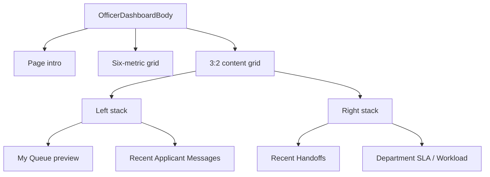

# D29R — Internal Body Visual Reference

**Status:** IMPLEMENTATION READY  
**Scope:** Internal page body only  
**Frozen:** Sidebar, top bar, account controls, notification controls, role switching, demo controls, routes, and shell resizing  
**Canonical dashboard reference:** `01-officer-dashboard.png` and its body crop, `Screenshot 2026-07-23 at 14.28.07(1).png`

## 1. Purpose

This document defines the body-level visual system that must be used for the officer dashboard and reused by later officer, supervisor, handoff, and admin screens.

The current dashboard cannot reach the reference by changing colours or reducing a few font sizes. Its information architecture is different. The reference uses a compact operations workspace:

- a small page introduction;
- six horizontally composed action metrics;
- a five-row queue preview with no filter toolbar;
- a short handoff activity feed;
- a short applicant-message feed;
- a combined SLA and workload panel;
- thin borders, low-radius surfaces, small type, and almost no decorative shadow.

The target is visual parity with the reference, not a loose interpretation of it.

## 2. Scope boundary

### Change

- Everything rendered inside `OfficerDashboardBody`.
- Dashboard body layout, spacing, type sizes, card composition, tables, badges, icon tiles, feeds, chart presentation, and reference fixture content.
- Shared body primitives used by the dashboard and later internal screens.

### Do not change

- `InternalAppShell`.
- Sidebar markup, width, collapse behaviour, labels, active item, or persistence.
- Top-bar height, global search, keyboard shortcut, notification button, profile area, or shell borders.
- Route URLs.
- Demo reset, role switcher, local state, or existing request actions.
- Global colour values already consumed by the shell.

The body must be independently replaceable without changing shell layout.

## 3. Reference hierarchy

| Reference | Authority |
| --- | --- |
| `Screenshot 2026-07-23 at 14.28.07(1).png` | Exact officer-dashboard body composition and density |
| `01-officer-dashboard.png` | Body in its frozen officer shell |
| `02-officer-queue.png` | Queue-page metric, filter, table, pagination, and right-rail patterns |
| `03-handoff-collaboration.png` | Handoff metrics, funnel, timeline, table, conversation, and assistance list |
| `04-referral-composer.png` | Two-column case context and structured form pattern |
| `05-workflow-invites.png` | Tabbed table and persistent detail-panel pattern |
| `06-returned-cases.png` | Full-width operational table and view-toggle pattern |
| `07-department-handoff-inbox.png` | Table plus selected-handoff detail rail |

Do not combine every reference into one dashboard. The officer dashboard follows the first two references; the other images define the shared visual grammar for later pages.

## 4. Required correction from the current body

| Current body | Required body |
| --- | --- |
| “Officer workspace” eyebrow | Remove |
| 48px greeting | Compact 24px greeting |
| “Good morning, Grace” | `Good morning, Grace 👋` |
| Long operational subtitle | `Here’s an overview of your work and priorities today.` |
| Body-level `View reports` and `Public portal` buttons | Remove from body |
| Tall KPI cards with descriptions | Compact horizontal metric cards with action links |
| Mostly blue icon treatment | Six semantic pastel tones |
| Filter toolbar inside dashboard queue | Remove; filters belong on the full queue page |
| Request/service/status/priority/submitted/SLA/action schema | Request/applicant/type/priority/due date/status/chevron schema |
| Large status badges with dots | Small, soft, no-dot pills |
| Handoff status cards | Five-row directional handoff activity list |
| Large message cards | Three-row compact message feed |
| No visible SLA/workload module | Add donut, legend, workload snapshot, and target note |
| 18–28px radii and obvious shadow | 8–12px radii, 1px border, almost flat surfaces |
| Oversized vertical whitespace | Compact 12–24px operational spacing |

## 5. Desktop reference canvas

The canonical full-shell screenshot is `1672 × 941`.

The shell is frozen. For body parity, use this approximate measured frame:

| Region | Reference contract |
| --- | --- |
| Main area begins | Immediately after the frozen sidebar and top bar |
| Body horizontal padding | 38–40px left, 20–24px right |
| Body top padding | 12–16px |
| Page intro to metric row | 22–24px |
| Metric grid | Six equal columns |
| Metric gap | 14–16px |
| Metric height | 112–116px |
| Metric row to content grid | 18–20px |
| Content columns | `3fr 2fr` |
| Content column gap | 22–24px |
| Left stack gap | 16–18px |
| Right stack gap | 16–18px |

At the canonical viewport the body should fit without horizontal scrolling. The first dashboard view should show the six metrics, the complete five-row queue, the complete handoff list, the messages panel, and the SLA/workload panel.

## 6. Body-scoped tokens

Do not change the existing global `--primary`, `--foreground`, `--border`, or shell tokens. Add a body scope in `app/globals.css`, then consume only these variables inside internal body components.

```css
.internal-dashboard-body {
  --ops-page: #fdfdfe;
  --ops-surface: #ffffff;
  --ops-ink: #090e4f;
  --ops-text: #262d68;
  --ops-muted: #636b98;
  --ops-faint: #8c93b4;
  --ops-border: #e2e5e9;
  --ops-border-strong: #d3d7e7;
  --ops-action: #1a61f8;
  --ops-action-hover: #0f50d8;

  --ops-blue: #1a61f8;
  --ops-blue-soft: #eaf2ff;
  --ops-orange: #ff6a00;
  --ops-orange-soft: #fff1e5;
  --ops-red: #ef2637;
  --ops-red-soft: #ffe9ec;
  --ops-purple: #7433ff;
  --ops-purple-soft: #f2eaff;
  --ops-green: #11a84b;
  --ops-green-soft: #e9f8ee;

  --ops-radius-panel: 10px;
  --ops-radius-control: 7px;
  --ops-radius-pill: 6px;
  --ops-shadow-panel: 0 1px 3px rgb(9 14 79 / 4%);

  background: var(--ops-page);
  color: var(--ops-text);
}
```

The variables are intentionally scoped. They reproduce the operational reference while leaving the shell untouched.

## 7. Typography

Use the project’s existing Plus Jakarta Sans setup. Do not introduce a new font.

| Element | Size / line-height | Weight | Colour |
| --- | --- | --- | --- |
| Page greeting | 24px / 30px | 700 | `--ops-ink` |
| Page subtitle | 13px / 20px | 400–500 | `--ops-muted` |
| Panel title | 16px / 22px | 600–700 | `--ops-ink` |
| Metric label | 12px / 16px | 600 | `--ops-text` |
| Metric value | 22px / 28px | 700 | `--ops-ink` |
| Action link | 12px / 16px | 600 | `--ops-action` |
| Table heading | 11px / 16px | 600 | `--ops-muted` |
| Row primary | 12px / 17px | 600 | `--ops-ink` |
| Row secondary | 11px / 16px | 400–500 | `--ops-muted` |
| Badge | 11px / 16px | 600 | semantic |
| Footer note | 11px / 16px | 400–500 | `--ops-muted` |
| Chart centre value | 26px / 30px | 700 | `--ops-ink` |

Rules:

- Use sentence case, not all caps, except IDs supplied by the domain.
- Keep titles to one line where the reference does.
- Use tabular numerals for counts, dates, SLA figures, and IDs.
- Do not use 18px body copy inside dashboard panels.

## 8. Surface and control language

### Panels

- Background: white.
- Border: 1px solid `--ops-border`.
- Radius: 10px.
- Shadow: either none or `--ops-shadow-panel`.
- Do not use glass effects, blur, gradients, or large floating shadows on this dashboard.

### Controls

- Height: 30–34px in compact tables and panels.
- Radius: 7px.
- Border: 1px solid `--ops-border-strong`.
- Primary action text: bright blue.
- Icon-only controls require an accessible name and visible focus state.

### Action links

- Text plus a 14px `ArrowRight`.
- Gap: 5–6px.
- No filled background in the resting state.
- Underline may appear on hover but not by default.

### Icon tiles

- Metric tile: 48 × 48px circular or very softly rounded.
- Feed/table tile: 30–34px circular or 8px rounded.
- Metric icon: 21–24px, stroke width 2.
- Feed/table icon: 15–18px, stroke width 2.
- Colour is semantic and must match its soft background.

## 9. Officer dashboard composition



### 9.1 Page intro

Render only:

- `Good morning, Grace 👋`
- `Here’s an overview of your work and priorities today.`

Do not render an eyebrow or body actions. The shell already owns top-level utilities.

### 9.2 Metric grid

Use exactly six metrics in this order:

| Label | Value | Tone | Action |
| --- | ---: | --- | --- |
| Assigned to Me | 18 | Blue | View my queue |
| Due Today | 7 | Orange | View due today |
| Overdue | 3 | Red | View overdue |
| Waiting on Applicant | 24 | Purple | View all |
| Waiting on Department | 11 | Orange | View all |
| Completed Today | 12 | Green | View report |

Metric-card contract:

- Six equal columns at the canonical desktop viewport.
- Horizontal top section: icon tile plus label/value stack.
- Action link aligns under the label/value stack, not under the icon.
- No descriptive sentence.
- No hover translation.
- Entire card may be a link only when there is one destination; otherwise the action link is the interactive target.

Suggested internal layout:

```css
.metricCard {
  min-width: 0;
  height: 116px;
  display: grid;
  grid-template-columns: 48px minmax(0, 1fr);
  grid-template-rows: auto 1fr;
  column-gap: 14px;
  padding: 16px;
  border: 1px solid var(--ops-border);
  border-radius: var(--ops-radius-panel);
  background: var(--ops-surface);
}

.metricCardAction {
  grid-column: 2;
  align-self: end;
}
```

### 9.3 Queue preview panel

Header:

- Title: `My Queue`
- Suffix: `(Next 5)` in muted text.
- Action: `View full queue`.

Do not include search, filters, sorting, or request count controls in this preview. Those controls belong on `/demo/officer/queue`.

Columns:

1. Request
2. Applicant
3. Type
4. Priority
5. Due Date
6. Status
7. Unlabelled row-detail action

Rows:

| Request | Applicant | Type | Priority | Due |
| --- | --- | --- | --- | --- |
| Transcript Request / `REQ-2026-0715` | Brian Otieno / `APP-2026-0201` | Transcript | High | May 12, 2026 / Overdue |
| Certificate Replacement / `REQ-2026-0718` | Mercy Akinyi / `APP-2026-0188` | Certificate | Medium | May 14, 2026 / Due in 1 day |
| Clearance Letter / `REQ-2026-0722` | Kevin Mwangi / `APP-2026-0223` | Clearance | Medium | May 15, 2026 / Due in 2 days |
| Grade Review / `REQ-2026-0726` | Linda Njeri / `APP-2026-0241` | Academic | Low | May 18, 2026 / Due in 5 days |
| Course Registration / `REQ-2026-0728` | Daniel Kiptoo / `APP-2026-0199` | Registration | Low | May 19, 2026 / Due in 6 days |

Row styling:

- Header height: 30–32px.
- Row height: 51–54px.
- Request cell begins with a 30–32px semantic icon tile.
- Priority is a small no-dot soft badge.
- `Overdue` is red; future relative labels are muted.
- Status is a compact outlined button labelled `Review` or `Verify`.
- Final action is a 30–32px chevron button with an accessible label.
- Rows are separated by 1px dividers; no zebra striping.

Footer:

- Left: `Showing 5 of 18 assigned requests`.
- Centre/right: `View full queue`.
- Height: 34–38px.

### 9.4 Recent handoffs panel

Header:

- Title: `Recent Handoffs`
- Action: `View all`

Five activity rows:

1. From Admissions Office — Transcript Request · `REQ-2026-0709`
2. To Finance Office — Certificate Replacement · `REQ-2026-0718`
3. Completed to Applicant — Clearance Letter · `REQ-2026-0703`
4. To Registrar Office — Grade Review · `REQ-2026-0711`
5. Completed to Applicant — Transcript Request · `REQ-2026-0698`

Use:

- green downward/completed tone for incoming or completed actions;
- blue upward tone for outgoing actions;
- 32px icon circles;
- primary and secondary text on the left;
- two-line date/time aligned right;
- approximately 51–54px per row.

Do not render large uppercase status badges in this feed.

### 9.5 Recent applicant messages panel

Header:

- Title: `Recent Applicant Messages`
- Action: `View full messages`

Render three rows:

- Brian Otieno — transcript follow-up — Unread.
- Mercy Akinyi — certificate replacement follow-up — Unread.
- Kevin Mwangi — clearance-letter timeline — Read.

Each row contains:

- 30–32px initials avatar;
- applicant and subject;
- one-line message preview, ellipsized;
- date and time;
- compact read/unread pill.

Footer action: `Go to all messages`.

### 9.6 Department SLA / Workload panel

Header:

- Title: `Department SLA / Workload`
- Action: `View detailed report`

Content grid:

- left analytics card: flexible width;
- right workload card: approximately 160–176px at the canonical viewport;
- gap: 12px.

SLA donut:

- centre: `92%` and `On-time`;
- on-time: 92% (344), green;
- due soon: 6% (22), orange;
- overdue: 2% (7), red;
- no tooltip is required in the static dashboard view;
- use Recharts, not a CSS border hack.

Workload snapshot:

- Total Assigned: 82
- In Progress: 39
- Due Today: 7
- Overdue: 3 in red

Footer note:

`SLA target: 95% · Calculated from requests closed in the last 30 days`

## 10. Shared badge rules

| Meaning | Background | Text | Border | Dot |
| --- | --- | --- | --- | --- |
| High / overdue / danger | Red soft | Red | Red soft/none | No |
| Medium / due soon / warning | Orange soft | Orange | Orange soft/none | No |
| Low / on track / completed | Green soft | Green | Green soft/none | No |
| New / in progress / unread | Blue soft | Blue | Blue soft/none | No |
| Returned / waiting | Purple soft | Purple | Purple soft/none | No |
| Read / neutral | Light neutral | Muted | Neutral | No |

The dot variant remains available elsewhere, but it must not be the default for the reference dashboard.

## 11. Responsive behaviour

Desktop parity is the first requirement. Responsive layouts must preserve the same component language:

| Width | Metric grid | Main grid |
| --- | --- | --- |
| `≥ 1440px` | 6 columns | `3fr 2fr` |
| `1200–1439px` | 3 columns × 2 rows | `3fr 2fr` if both columns remain readable |
| `900–1199px` | 3 columns × 2 rows | Single column |
| `640–899px` | 2 columns × 3 rows | Single column |
| `< 640px` | 1 column | Single column; table uses controlled horizontal overflow |

Rules:

- Never squeeze the six cards until labels overlap.
- Do not hide metrics on smaller screens.
- Keep table columns intact inside a horizontally scrollable wrapper.
- Do not turn desktop tables into unrelated card designs during D29R.
- Preserve a minimum 44px touch target where the page is expected to be used on touch devices.

## 12. Visual acceptance

The body is visually approved only when:

- the greeting, metric order, labels, values, table data, handoff data, message data, and SLA data match the reference fixture;
- six metrics sit on one row at the canonical desktop viewport;
- the current eyebrow, body actions, KPI descriptions, queue filter toolbar, and old handoff cards are gone;
- the left/right content ratio matches the reference;
- the five-row queue and five-row handoff feed are visible without body-level horizontal scrolling;
- colours come from the scoped operational tokens;
- no shell file or shell class changed;
- the full-shell screenshot at `1672 × 941` can be overlaid on `01-officer-dashboard.png` without structural drift;
- text wrapping differences are limited to unavoidable font-rendering variation.

## 13. Explicit non-goals

- No backend or Supabase changes.
- No D29R-4 request-detail implementation.
- No new shell work.
- No dashboard theme switcher.
- No redesign of the applicant/public portal.
- No attempt to implement every panel shown in references 2–7 on the officer dashboard.

