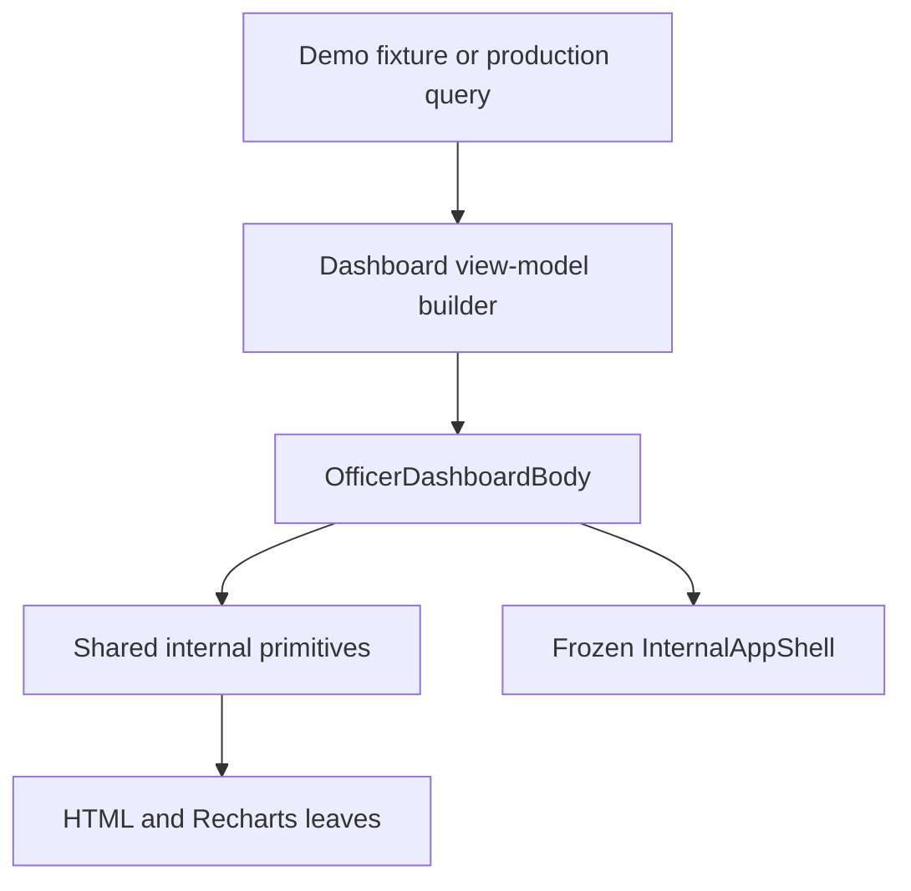

# D29R — Internal Component Architecture

**Status:** IMPLEMENTATION READY  
**Applies to:** Demo Engine now; staged FAIDIA V1 later  
**Repository rule:** One Next.js application, one design system, one shared component implementation  
**Path rule:** The project uses root-level `app/`, not `src/app/`

## 1. Architecture decision

Build one reusable internal body system and feed it different view models.

- Demo routes use deterministic fixture adapters and local demo state.
- The real application later uses server-side query adapters.
- Both render the same body components.
- Components receive display-ready view models, not Drizzle rows or Supabase responses.
- Pages assemble components; pages do not contain business rules.
- The shell wraps the body but does not own its cards, tables, feeds, or charts.

This prevents the demo from becoming a disposable copy and prevents production database details from leaking into visual components.

## 2. Recommended file structure

```text
app/
├── globals.css
├── demo/
│   └── officer/
│       ├── page.tsx
│       ├── queue/
│       │   └── page.tsx
│       ├── handoffs/
│       │   └── page.tsx
│       └── requests/
│           └── [requestId]/
│               └── page.tsx
└── (internal)/
    └── officer/
        └── page.tsx                      # later production route

components/
└── internal/
    ├── body/
    │   ├── operations-page.tsx
    │   ├── page-intro.tsx
    │   ├── section-panel.tsx
    │   ├── panel-header.tsx
    │   └── action-link.tsx
    ├── metrics/
    │   ├── metric-grid.tsx
    │   ├── metric-card.tsx
    │   └── metric-icon.tsx
    ├── table/
    │   ├── operations-table.tsx
    │   ├── stacked-cell.tsx
    │   ├── row-icon.tsx
    │   ├── compact-action-button.tsx
    │   └── table-footer.tsx
    ├── status/
    │   ├── status-badge.tsx
    │   ├── priority-badge.tsx
    │   └── status-tone.ts
    ├── feed/
    │   ├── activity-list.tsx
    │   ├── activity-row.tsx
    │   ├── message-preview-list.tsx
    │   └── message-preview-row.tsx
    ├── charts/
    │   ├── sla-donut.tsx                 # only this leaf needs "use client"
    │   ├── chart-legend.tsx
    │   └── workload-snapshot.tsx
    ├── filters/
    │   ├── compact-search.tsx
    │   ├── filter-button.tsx
    │   ├── sort-select.tsx
    │   └── view-toggle.tsx
    ├── detail/
    │   ├── detail-rail.tsx
    │   ├── definition-list.tsx
    │   ├── document-link.tsx
    │   └── detail-actions.tsx
    ├── timeline/
    │   ├── compact-timeline.tsx
    │   └── timeline-item.tsx
    └── internal-body.module.css

features/
├── officer-dashboard/
│   ├── components/
│   │   ├── officer-dashboard-body.tsx
│   │   ├── queue-preview-panel.tsx
│   │   ├── recent-handoffs-panel.tsx
│   │   ├── recent-messages-panel.tsx
│   │   └── sla-workload-panel.tsx
│   ├── model/
│   │   ├── officer-dashboard-model.ts
│   │   ├── officer-dashboard-schema.ts
│   │   └── build-officer-dashboard-model.ts
│   ├── server/
│   │   └── get-officer-dashboard-model.ts
│   └── tests/
│       ├── officer-dashboard-body.test.tsx
│       └── officer-dashboard-model.test.ts
├── officer-queue/
│   ├── components/
│   ├── model/
│   ├── server/
│   └── tests/
└── handoffs/
    ├── components/
    ├── model/
    ├── server/
    └── tests/

features/demo-engine/
├── fixtures/
│   ├── officer-dashboard.reference.ts
│   ├── officer-queue.reference.ts
│   ├── handoffs.reference.ts
│   └── requests.reference.ts
├── adapters/
│   ├── get-demo-officer-dashboard-model.ts
│   └── get-demo-officer-queue-model.ts
└── state/
    └── demo-store.ts

tests/
├── visual/
│   ├── officer-dashboard.visual.spec.ts
│   └── reference/
│       └── 01-officer-dashboard.png
└── e2e/
    └── officer-dashboard.spec.ts
```

Do not create a second set of `demo/components/MetricCard`, `demo/components/Table`, and `production/components/MetricCard`. The view-model adapter is the boundary, not duplicated UI.

## 3. Render tree



`InternalAppShell` is shown as the wrapper relationship only. D29R body work must not edit it.

## 4. View-model contracts

Use display contracts that can be produced by either demo data or production queries.

```ts
export type OperationalTone =
  | "neutral"
  | "blue"
  | "orange"
  | "red"
  | "purple"
  | "green";

export type OperationalIconKey =
  | "clipboard"
  | "calendar-check"
  | "clock"
  | "applicant"
  | "department"
  | "completed"
  | "document"
  | "shield"
  | "arrow-in"
  | "arrow-out";

export interface DashboardAction {
  label: string;
  href: string;
  ariaLabel?: string;
}

export interface DashboardMetricModel {
  id: string;
  label: string;
  value: number | string;
  tone: OperationalTone;
  icon: OperationalIconKey;
  action: DashboardAction;
}

export interface QueuePreviewRowModel {
  requestId: string;
  requestTitle: string;
  requestHref: string;
  requestIcon: OperationalIconKey;
  requestTone: OperationalTone;
  applicantName: string;
  applicantReference: string;
  typeLabel: string;
  priority: {
    label: "High" | "Medium" | "Low";
    tone: "red" | "orange" | "green";
  };
  dueAt: string;
  dueDateLabel: string;
  dueState: {
    label: string;
    tone: "red" | "neutral";
  };
  statusAction: {
    label: "Review" | "Verify";
    href: string;
  };
}

export interface HandoffActivityModel {
  id: string;
  title: string;
  subject: string;
  requestReference: string;
  occurredAt: string;
  dateLabel: string;
  timeLabel: string;
  direction: "incoming" | "outgoing" | "completed";
  href: string;
}

export interface ApplicantMessagePreviewModel {
  id: string;
  applicantName: string;
  applicantInitials: string;
  subject: string;
  preview: string;
  occurredAt: string;
  dateLabel: string;
  timeLabel: string;
  readState: "read" | "unread";
  href: string;
}

export interface SlaBreakdownModel {
  targetPercent: number;
  onTime: { percent: number; count: number };
  dueSoon: { percent: number; count: number };
  overdue: { percent: number; count: number };
  periodLabel: string;
  calculationNote: string;
}

export interface WorkloadSnapshotModel {
  totalAssigned: number;
  inProgress: number;
  dueToday: number;
  overdue: number;
}

export interface OfficerDashboardModel {
  greeting: string;
  subtitle: string;
  metrics: DashboardMetricModel[];
  queue: {
    rows: QueuePreviewRowModel[];
    totalAssigned: number;
    fullQueueHref: string;
  };
  handoffs: {
    rows: HandoffActivityModel[];
    allHref: string;
  };
  messages: {
    rows: ApplicantMessagePreviewModel[];
    allHref: string;
  };
  sla: SlaBreakdownModel;
  workload: WorkloadSnapshotModel;
  detailedReportHref: string;
}
```

Rules:

- Leaf components must not receive database records.
- Format display labels in the model builder so presentation is deterministic.
- Keep ISO timestamps for sorting, semantics, and future localization.
- Use icon keys rather than passing arbitrary JSX from fixture data.
- Centralize icon-key and tone mappings.

## 5. Body assembly

The page should remain thin:

```tsx
// app/demo/officer/page.tsx
import { OfficerDashboardBody } from "@/features/officer-dashboard/components/officer-dashboard-body";
import { getDemoOfficerDashboardModel } from "@/features/demo-engine/adapters/get-demo-officer-dashboard-model";

export default function DemoOfficerDashboardPage() {
  const model = getDemoOfficerDashboardModel();

  return <OfficerDashboardBody model={model} />;
}
```

The production route later uses the same body:

```tsx
// app/(internal)/officer/page.tsx
import { OfficerDashboardBody } from "@/features/officer-dashboard/components/officer-dashboard-body";
import { getOfficerDashboardModel } from "@/features/officer-dashboard/server/get-officer-dashboard-model";

export default async function OfficerDashboardPage() {
  const model = await getOfficerDashboardModel();

  return <OfficerDashboardBody model={model} />;
}
```

The shared body:

```tsx
export function OfficerDashboardBody({
  model,
}: {
  model: OfficerDashboardModel;
}) {
  return (
    <main className="internal-dashboard-body">
      <OperationsPage>
        <PageIntro title={model.greeting} subtitle={model.subtitle} />

        <MetricGrid>
          {model.metrics.map((metric) => (
            <MetricCard key={metric.id} metric={metric} />
          ))}
        </MetricGrid>

        <div className={styles.dashboardGrid}>
          <div className={styles.dashboardStack}>
            <QueuePreviewPanel model={model.queue} />
            <RecentMessagesPanel model={model.messages} />
          </div>

          <div className={styles.dashboardStack}>
            <RecentHandoffsPanel model={model.handoffs} />
            <SlaWorkloadPanel
              sla={model.sla}
              workload={model.workload}
              reportHref={model.detailedReportHref}
            />
          </div>
        </div>
      </OperationsPage>
    </main>
  );
}
```

## 6. Component contracts

### `OperationsPage`

Owns:

- body padding;
- body background;
- content width;
- vertical rhythm.

Does not own:

- sidebar/topbar offsets;
- navigation;
- route data.

### `PageIntro`

Props:

```ts
interface PageIntroProps {
  title: string;
  subtitle?: string;
  actions?: React.ReactNode;
  breadcrumbs?: React.ReactNode;
  density?: "compact" | "default";
}
```

Dashboard uses `density="compact"` and no body actions.

### `MetricCard`

Props:

```ts
interface MetricCardProps {
  metric: DashboardMetricModel;
  layout?: "dashboard" | "queue";
}
```

- `dashboard`: 48px icon, label/value/action stack, 116px high.
- `queue`: wider horizontal card used on the full queue page.

Do not create separate copied components for these two layouts.

### `SectionPanel`

Props:

```ts
interface SectionPanelProps {
  title: React.ReactNode;
  action?: React.ReactNode;
  children: React.ReactNode;
  footer?: React.ReactNode;
  bodyPadding?: "none" | "compact" | "default";
  className?: string;
}
```

It owns the border, radius, header divider, and optional footer divider.

### `OperationsTable`

Build on TanStack Table when sorting, filtering, pagination, or selection is required. The dashboard preview may use the same column definitions with those behaviours disabled.

Props:

```ts
interface OperationsTableProps<TData> {
  data: TData[];
  columns: ColumnDef<TData>[];
  density?: "dense" | "compact";
  getRowHref?: (row: TData) => string;
  emptyState?: React.ReactNode;
  footer?: React.ReactNode;
  ariaLabel: string;
}
```

Do not place queue search/filter UI inside the table component. Compose `QueueFilterBar` above it on the full queue page.

### `StatusBadge`

Props:

```ts
interface StatusBadgeProps {
  label: string;
  tone: OperationalTone;
  size?: "compact" | "default";
  dot?: boolean;
}
```

Reference dashboard always passes `dot={false}`.

### `ActivityList`

Generic for recent handoffs, recent approvals, and audit summaries.

```ts
interface ActivityListProps<TItem> {
  items: TItem[];
  renderIcon: (item: TItem) => React.ReactNode;
  renderPrimary: (item: TItem) => React.ReactNode;
  renderSecondary: (item: TItem) => React.ReactNode;
  renderMeta: (item: TItem) => React.ReactNode;
  getKey: (item: TItem) => string;
}
```

Keep domain mapping in the feature panel, not in the primitive.

### `SlaDonut`

This is the only dashboard leaf that should require `"use client"`.

```ts
interface SlaDonutProps {
  data: SlaBreakdownModel;
  size?: "compact" | "default";
  showTooltip?: boolean;
}
```

Use `ResponsiveContainer`, `PieChart`, and `Pie`. Keep legend HTML outside Recharts so typography and alignment remain exact.

## 7. CSS ownership

### `app/globals.css`

Add only:

- `.internal-dashboard-body` scoped tokens;
- any genuinely global operational utilities that multiple internal feature modules consume.

Do not change existing shell token values.

### `components/internal/internal-body.module.css`

Own:

- page padding;
- metric grid;
- panel base;
- compact typography;
- table density;
- action links;
- shared responsive rules.

### Feature CSS modules

Own only feature composition:

- officer dashboard `3fr 2fr` grid;
- dashboard stack gaps;
- SLA inner grid;
- request-detail layouts introduced in D29R-4.

Do not repeat colours, border radii, font sizes, or control heights in every feature module.

## 8. Demo and production adapters

### Demo adapter

Responsibilities:

- read deterministic fixture data;
- apply current demo state where a click changes status;
- return the same `OfficerDashboardModel` shape;
- preserve reset and route behaviour.

### Production adapter

Responsibilities:

- authorize the officer and resolve organization/department membership;
- perform organization- and department-scoped reads;
- aggregate operational metrics;
- build display labels and safe links;
- return the same `OfficerDashboardModel`.

The component must not know which adapter produced its model.

## 9. Reference fixture policy

Keep an immutable parity fixture:

```text
features/demo-engine/fixtures/officer-dashboard.reference.ts
```

It must contain the exact names, counts, dates, rows, handoffs, messages, and SLA values shown in the canonical reference. This fixture is used by visual tests.

If the live demo needs changing data, create a derived runtime model. Do not mutate the parity fixture and silently invalidate the screenshot baseline.

## 10. Shared component map for later references

| Reference page | Reuse |
| --- | --- |
| Officer dashboard | `PageIntro`, `MetricGrid`, `MetricCard`, `SectionPanel`, `OperationsTable`, `ActivityList`, `MessagePreviewList`, `SlaDonut`, `WorkloadSnapshot` |
| Officer queue | `PageIntro`, queue-layout `MetricCard`, `QueueFilterBar`, `OperationsTable`, `StatusBadge`, `Pagination`, right-rail panels |
| Handoff collaboration | `MetricCard`, `SectionPanel`, `StatusBadge`, `OperationsTable`, `CompactTimeline`, `MessageComposer`, `QuickActionList` |
| Referral composer | `PageIntro`, `SectionPanel`, `DefinitionList`, form controls, segmented urgency control, notice, audit timeline |
| Workflow invites | `MetricCard`, tabs, `OperationsTable`, `DetailRail`, `CompactTimeline`, action footer |
| Returned cases | `PageIntro`, `MetricCard`, `QueueFilterBar`, `ViewToggle`, `OperationsTable`, pagination, help strip |
| Handoff inbox | `MetricCard`, `QueueFilterBar`, `OperationsTable`, `DetailRail`, `DocumentLink`, `DetailActions`, completed-activity list |

Do not use one giant `DashboardCard` with dozens of boolean props. Prefer small primitives composed into feature panels.

## 11. Server/client boundary

Server Components by default:

- page;
- view-model query;
- dashboard body;
- metrics;
- queue;
- feeds;
- workload list.

Client Components only where necessary:

- Recharts donut;
- full queue filters;
- table sorting/pagination when performed client-side in the demo;
- drawers, modals, and form interactions.

Keep `"use client"` out of shared panel and table primitives unless they genuinely need it.

## 12. Accessibility contract

- The page contains one `h1`.
- Each major panel title is an `h2`.
- Table uses a caption or `aria-label`.
- Icon-only buttons have explicit `aria-label`.
- Decorative icons use `aria-hidden="true"`.
- Search wrappers use `role="search"`.
- Links remain links; do not implement navigation with clickable `div`s.
- Buttons use visible focus rings that meet the existing focus-token contract.
- Status is never communicated by colour alone.
- Chart values are also present as accessible text in the legend.
- Rows that contain nested actions must not also be invalid nested links.

## 13. Testing structure

### Unit/component

- Metric cards render all six labels and action URLs.
- Tone mapping returns the correct class for each semantic state.
- Queue preview renders exactly five rows.
- Empty arrays render intentional empty states.
- SLA percentages and counts render as text.
- The chart component handles zero totals.

### Integration

- Demo dashboard routes to the correct queue filters.
- Request actions open `/demo/officer/requests/[requestId]`.
- Handoff and message actions preserve current demo behaviour.
- Demo reset restores the parity fixture.

### Visual

- Canonical desktop: `1672 × 941`.
- Additional confidence: `1440 × 900`, `1024 × 768`, `768 × 1024`, `390 × 844`.
- Test both full shell and body locator.
- Compare the canonical full-shell screenshot with `01-officer-dashboard.png`.

## 14. Prohibited shortcuts

- Do not hard-code all dashboard markup in `app/demo/officer/page.tsx`.
- Do not copy the reference into a background image.
- Do not use absolute positioning to fake the desktop screenshot.
- Do not introduce arbitrary hex values inside JSX or feature CSS.
- Do not change global shell colours to solve body parity.
- Do not render the full queue filter bar inside the dashboard preview.
- Do not bind UI components directly to Drizzle or Supabase record types.
- Do not make the whole dashboard a client component because the donut uses Recharts.
- Do not create parallel demo and production implementations.

